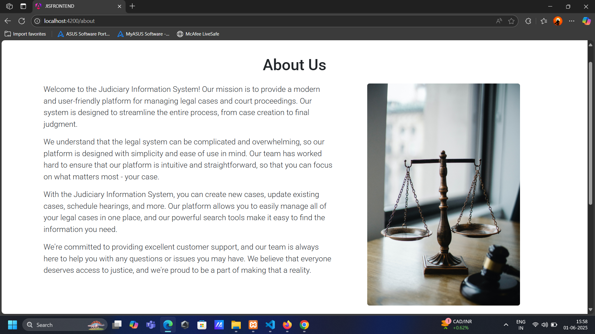
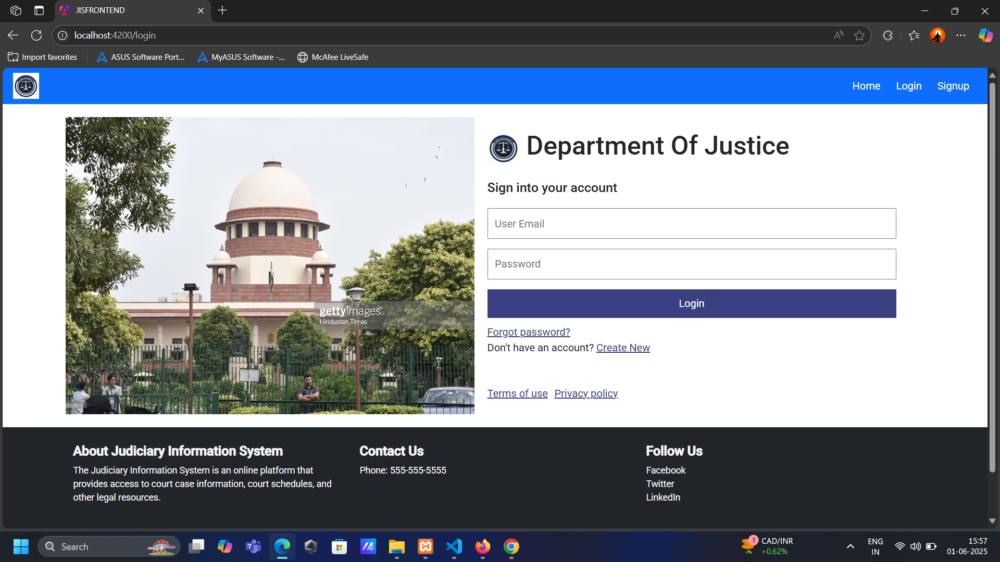
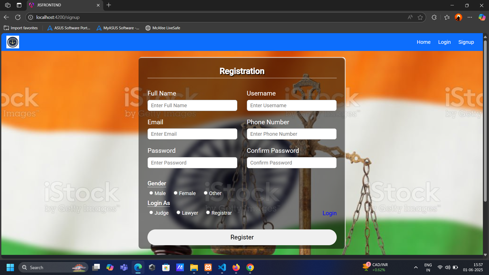
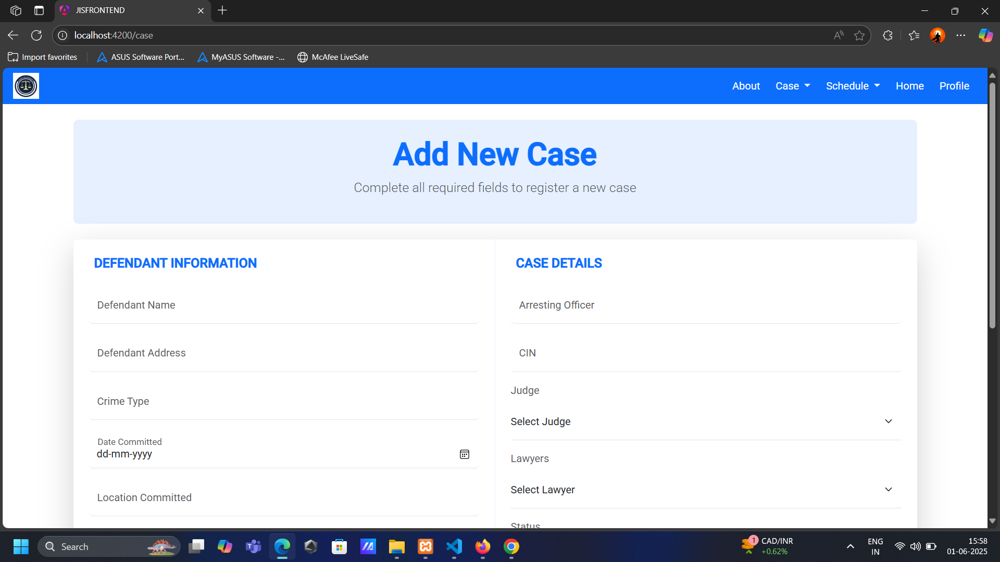
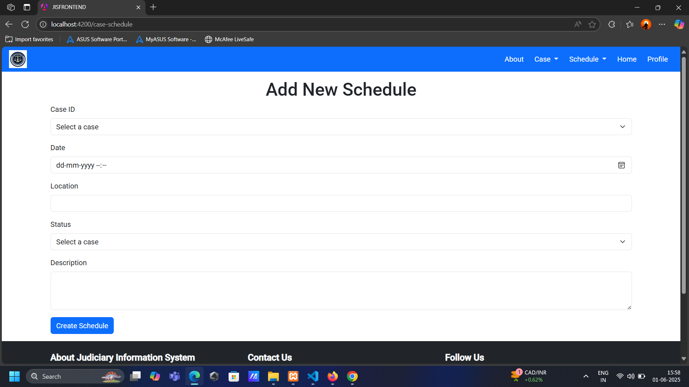
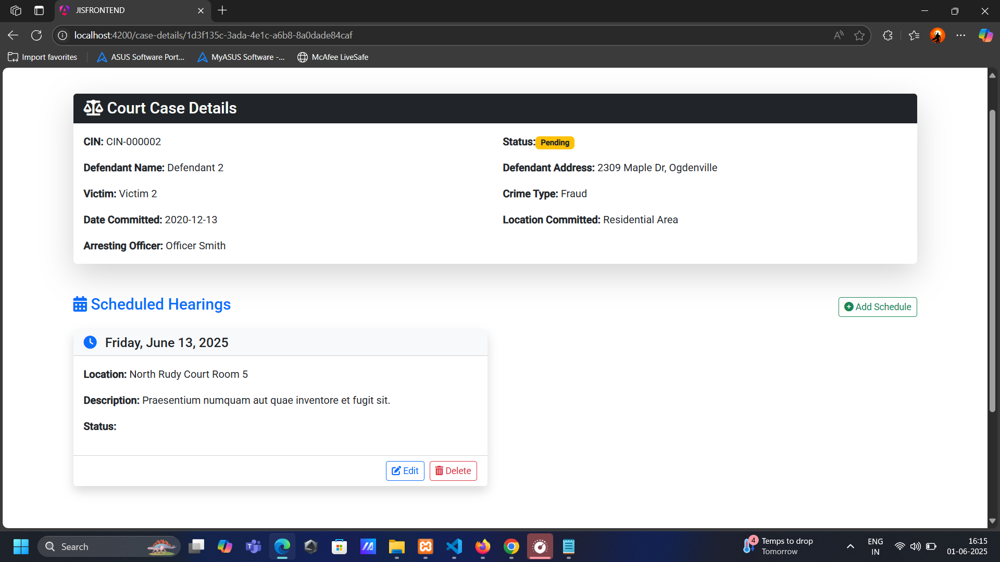

# 🏛️ Judiciary Information System (JIS)

The **Judiciary Information System (JIS)** is a full-stack web application designed to **modernize judicial processes**. This system enhances the efficiency of courts by managing legal cases, scheduling hearings, and enabling secure access for judges, lawyers, and registrars with personalized dashboards and role-specific features.

---

## 📘 About the Project

The project provides a centralized platform to:

- Manage and track court cases
- Add and schedule hearings
- Provide separate login access for Judges, Lawyers, and Registrars
- Ensure secure authentication and role-based control
- View comprehensive case details and history
- Simplify administrative and clerical work in judicial offices

It is built using a **modern web stack** for a responsive and intuitive user experience.

---

## 🚀 Tech Stack

- **Frontend:** Angular, HTML, CSS, Bootstrap, TypeScript  
- **Backend:** Laravel (PHP)
- **Database:** PostgreSQL
- **Version Control & Deployment:** Git, GitHub

---

## 📸 Screenshots

### 🏠 Home Page


### 🧾 About Page


### 🔐 Login Page


### ✍️ Signup Page


### 🗂️ Add Case


### 🕒 Add Schedule


### 📋 Case List


### 🔍 Case Details


### 👤 Profile Page


## 📂 Key Features

### 🔐 User Authentication
- Secure login/signup system with Laravel authentication
- Separate dashboards for Judges, Lawyers, and Registrars

### 📋 Case Management
- Add new legal cases with involved parties, description, and status
- Edit/update case details
- View detailed case snapshots

### 🕒 Hearing Schedule
- Schedule hearings for specific cases
- View upcoming and past hearing schedules

### 👤 Profile Management
- Each user can view and update their personal profile
- Judges and Lawyers can manage their assigned cases

### 🔍 Case Search & Filter
- Quickly browse and search court records by case ID, type, or party name

---


## 📂 Project Structure (Major Modules)

```bash
├── backend (Laravel)
│   ├── app/
│   ├── routes/
│   └── database/
├── frontend (Angular)
│   ├── src/
│   │   ├── app/
│   │   │   ├── auth/        # Login, Signup
│   │   │   ├── profile/     # Profile page
│   │   │   ├── cases/       # Case list and snapshots
│   │   │   └── schedules/   # Add/view hearing schedules
│   └── assets/
├── README.md
└── .gitignore
